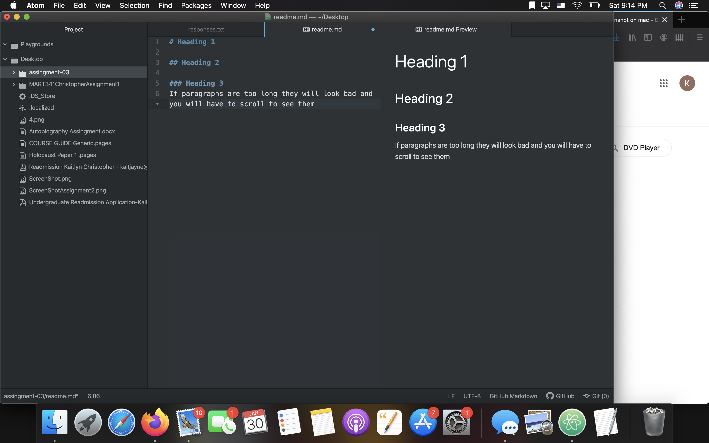

# Assignment 3

## Kaitlyn Christopher

### 3 Things I've Learned So far
1.If paragraphs are too long they will look bad and you will have to scroll to see them. You can use toggle soft wrap to fix this.

You need a full space between paragraphs to separate them.

The internet is complicated, but there is lot more physicality to it than I expected!

[reddit](https://www.reddit.com/)

[my responses](./responses.txt)

